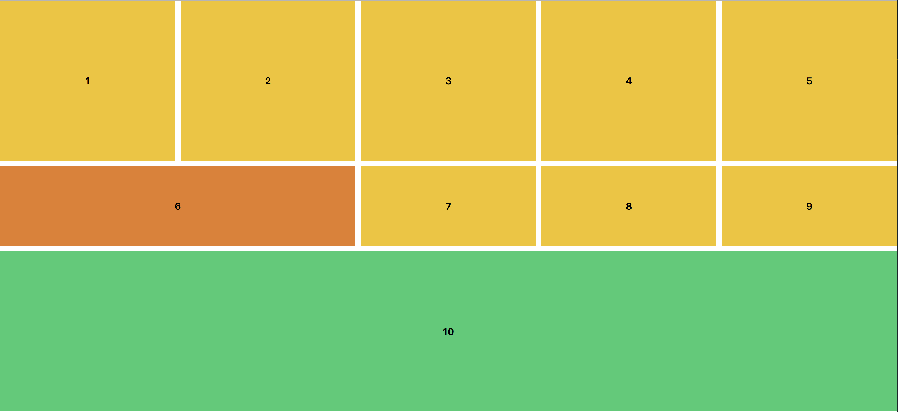
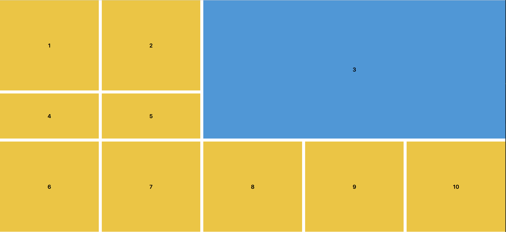
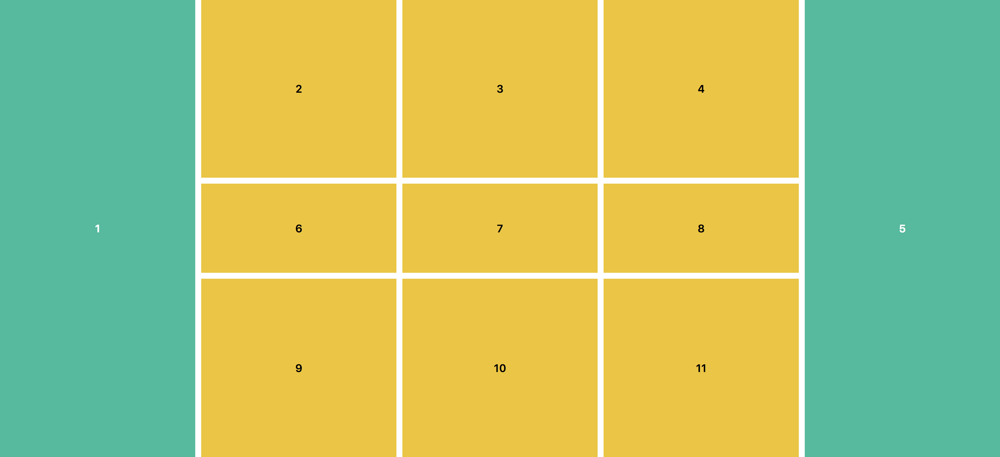
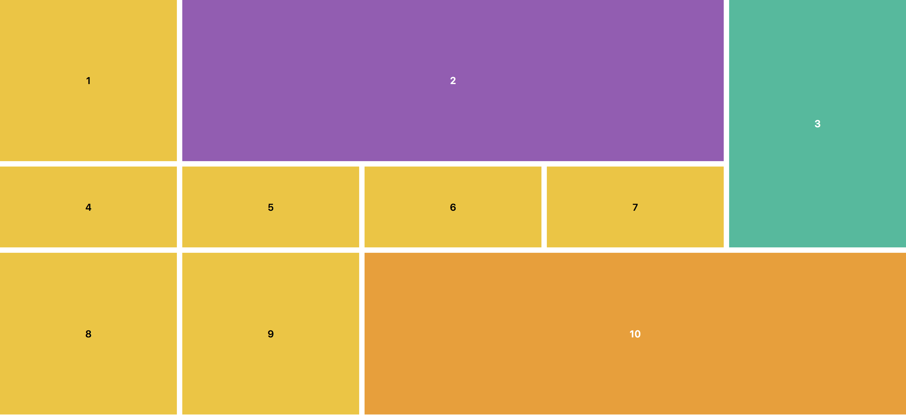
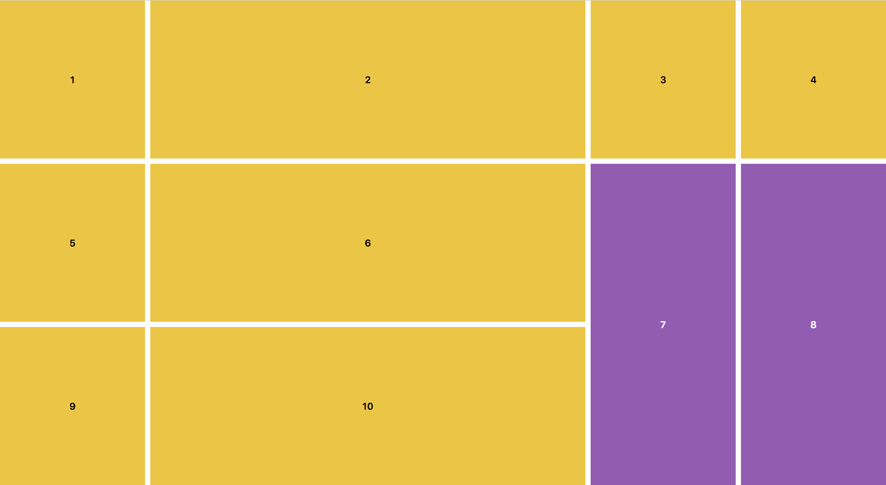

# Challenges

Rules

* Go to the [Code Sandbox](https://codesandbox.io/s/94jm6vo46y).
* Copy the html inside of `index.html`.
* Create a new folder and put your name on it.
* Inside of the folder create an `.html` file and paste what you copied.
* Create a new file for every challenge.

---

# Challenge: 01

---

# Challenge: 02

---

# Challenge: 03

---

# Challenge: 04

---

# Challenge: 05

---

# Challenge: 06

