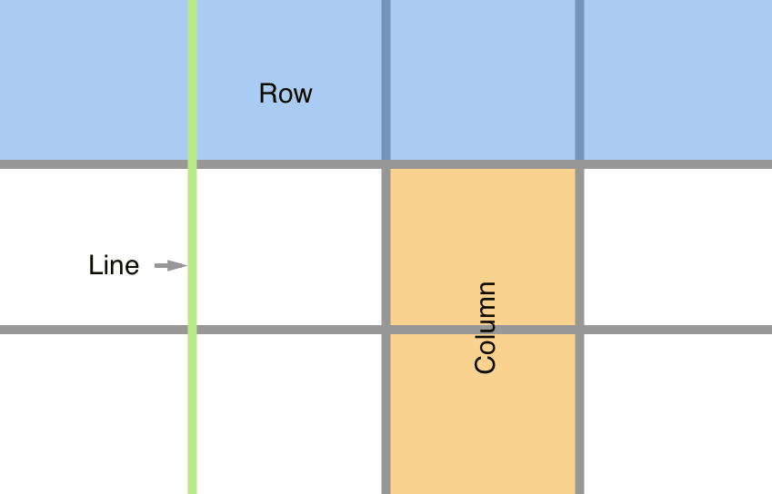

class: middle, center

# CSS Grid

## Building impossible layouts with CSS

---

# History

* Before there was

```css
.child {
  display: inline-block;
}
```

--

* Then there was

```css
.father {
  display: flex;
}
```

--

* Now we have

```css
.father {
  display: grid;
}
```

---

# Grid Rules

* `display:grid;` needs to applied to the container of the elements we want to move (just like flex) and also all the other properties that affect them.

--

* A grid has rows and columns

--

* Rows and columns are separated by lines

---

# How does it look?



---

# Agenda

* `grid-template-columns`: Define how many columns we need, and how big are they.

--

* `grid-template-rows`: Define how many rows we need, and how big are they.

--

* `grid-gap`: Define how thick are the lines.

--

* `grid-auto-rows`: Define what size to give to any extra rows.

--

* `grid-auto-columns`: Define what size to give to any extra columns.

--

* `grid-auto-flow`: What do we do with extra items? Should we make more columns or rows?

--

* `fr`: New measurment unit! Takes the space that is left.

--

* `repeat()`: Shorcut to create columns/rows.

--

* `grid-X-start` and `grid-X-end`: Placing items arbitrary.

--

* Challenges!

---

# Agenda

* `auto-fill`: Fills the row with as many columns as it can fit.

--

* `auto-fit`: Fits the currently available

--

* `minmax`: Use it to create fluid grid items.

--

* `grid-template-areas` & `grid-area`: Define the areas of your grid, visually.

---

# Item alignment

Just like flexbox we can use justify-\* and align-\*.

--

* `justify-items` and `align-items`: It modifies the items **inside** of the cell, justify is horizontal and align is vertical.

--

* `place-items`: Shorthand. `place-items: <align-items> / <justify-items>`

--

* `justify-content` and `align-content`: Moves **all** the cells, together, justify and align same same.

--

* `place-content`: Shorthand. `place-content: <align-items> / <justify-items>`
